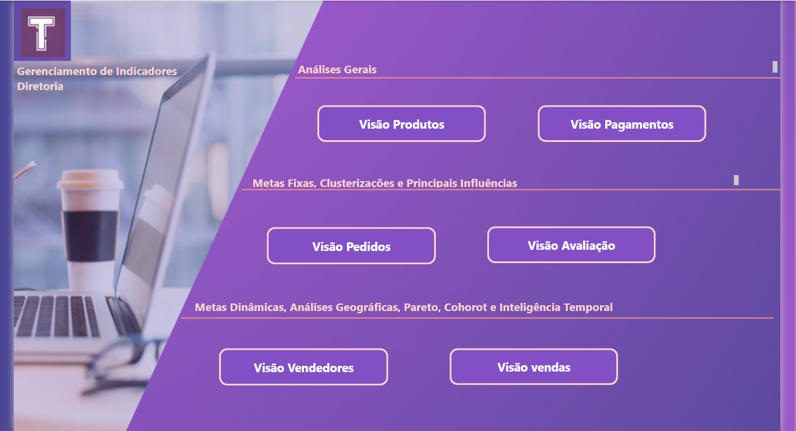
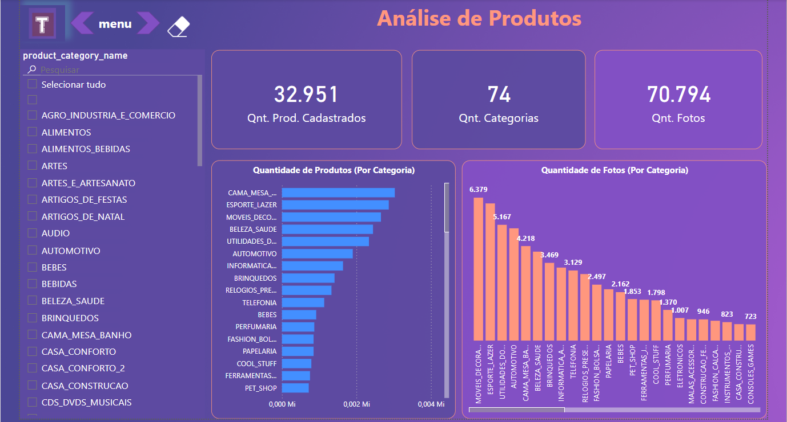
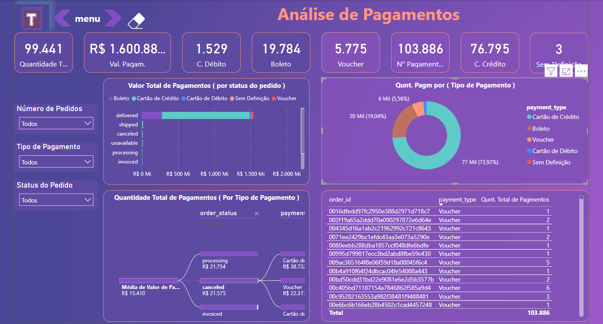
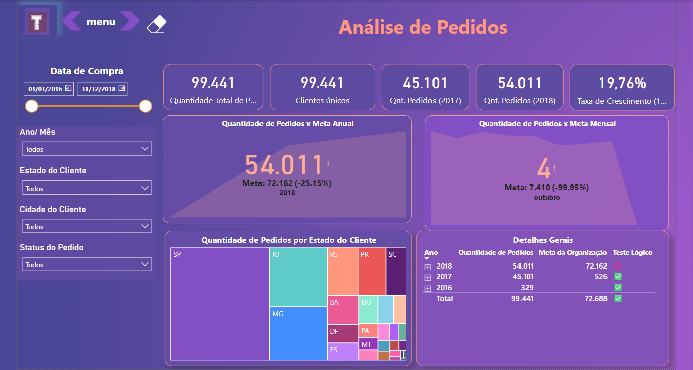
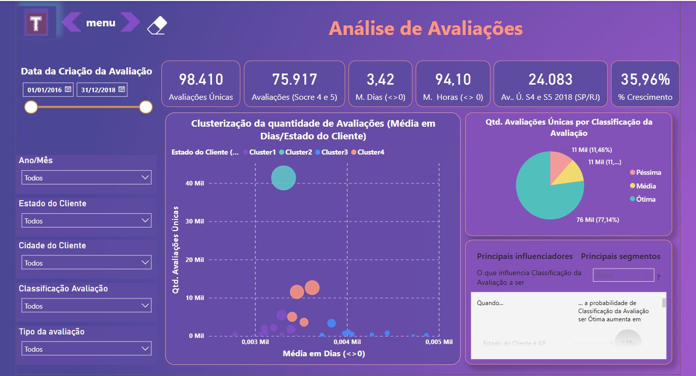
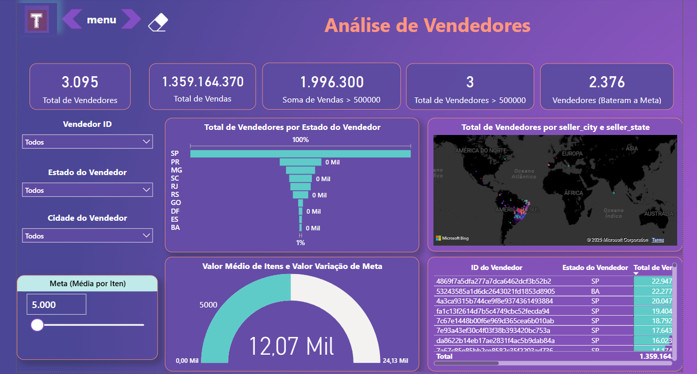
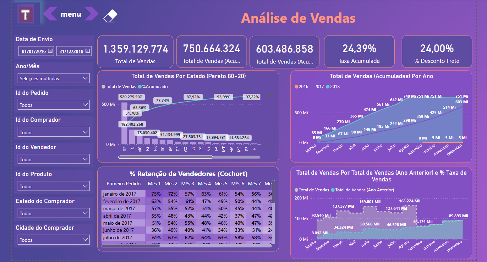

# 1. O Problema de Negócio

 Você foi contratado como Analista de Dados Júnior pela empresa TUDO AQUI, um e-commerce brasileiro em fase de expansão. Até então, a maior parte das decisões estratégicas da empresa era tomada de forma intuitiva, sem embasamento em dados concretos. Essa abordagem já resultou em decisões equivocadas e prejuízos financeiros.

  Reconhecendo a importância de dados para o crescimento sustentável, o CEO — que relatou se sentir "cego" em relação aos números do negócio — decidiu implementar uma cultura de Business Intelligence. A partir de agora, a empresa pretende abandonar decisões baseadas em suposições e adotar uma abordagem data-driven, orientada por indicadores e evidências.

  Para isso, foram desenvolvidas análises distribuídas por áreas de negócio, com visualizações que explicam o desempenho de cada setor e oferecem insights valiosos para a tomada de decisões estratégicas.

# 1.0. Menu
 Para tornar a experiência do usuário mais dinâmica, foi criado um menu interativo que reúne todas as visualizações disponíveis no dashboard.

## 1.1. Visão Produto

- a) Quantidade de Produtos Cadastrados  
- b) Quantidade Total de Categorias  
- c) Quantidade Total de Fotos  
- d) Quantidade de Produtos por Categoria  
- e) Quantidade de Fotos por Categoria  

## 1.2. Visão Pagamento

### 1.2.1. Cartões

- a) Quantidade de pedidos  
- b) Valor total de pagamentos  
- c) Quantidade de pagamentos  
- d) Quantidade de pagamentos por tipo de pagamento (um por cartão)  

### 1.2.2. Análises Gráficas

- a) Valor total de pagamentos (por status do pedido)  
- b) Quantidade de pagamentos (por tipo de pagamento)  
- c) Hierarquia de valor médio de pagamentos por status do pedido e por tipo de pagamento  
- d) Detalhes dos pedidos por tipo de pagamento e pela quantidade de pagamentos  

### 1.2.3. Segmentações

- a) Número do pedido  
- b) Tipo de Pagamento  
- c) Status do Pedido  

## 1.3. Visão Pedido

### 1.3.1. Cartões

- a) Quantidade de pedidos  
- b) Quantidade de clientes  
- c) Quantidade de pedidos do ano de 2017  
- d) Quantidade de pedidos do ano de 2018  
- e) Taxa de Crescimento (2017 - 2018)  

### 1.3.2. Análises Gráficas

- a) Quantidade de pedidos x Meta Anual  
- b) Quantidade de pedidos x Meta Mensal de 2018  
- c) Quantidade de Pedidos por Estado do Cliente  
- d) Detalhes da quantidade de pedidos e meta de pedidos por Ano, Mês, Estado do Cliente e Cidade do Cliente  

### 1.3.3. Segmentações

- a) Data de Compra  
- b) Ano / Mês (de compra)  
- c) Estado do Cliente  
- d) Cidade do Cliente  
- e) Status do Pedido  

## 1.4. Visão Avaliações

### 1.4.1. Cartões

- a) Quantidade de avaliações únicas  
- b) Quantidade de avaliações únicas para o score 4 e 5  
- c) Média de tempo em dias das avaliações que não receberam retorno no mesmo dia que a avaliação foi criada  
- d) Média de tempo em horas das avaliações que não receberam retorno no mesmo dia que a avaliação foi criada  
- e) Quantidade de avaliações únicas para o score 4 e 5 dos clientes dos estados SP e RJ apenas do ano de 2018  
- f) Taxa de crescimento entre os anos de 2018 e 2017 para os clientes score 4 e 5 dos estados SP e RJ  

### 1.4.2. Análises Gráficas

- a) Um gráfico de dispersão clusterizado por estado do cliente, quantidade de avaliações únicas e a média de tempo em dias das avaliações que não receberam retorno no mesmo dia que a avaliação foi criada  
- b) Um gráfico de Pizza que exibe a quantidade de avaliações únicas pela classificação da avaliação  
- c) Um gráfico com os principais influenciadores entre a classificação das avaliações e estado do cliente  

### 1.4.3. Segmentações

- a) Data de criação da avaliação  
- b) Ano e mês da criação da avaliação  
- c) Estado do Cliente  
- d) Cidade do Cliente  
- e) Classificação da Avaliação  
- f) Tipo de Avaliação  

## 1.5. Visão Vendedores

### 1.5.1. Cartões

- a) Quantidade total de vendedores (Detalhes de Vendedores)  
- b) Total de vendas  
- c) Total de vendas dos itens com valor superior a R$500.000 (Detalhes de Itens Vendidos)  
- d) Quantidade de vendedores que venderam itens com valor superior a R$500.000  
- e) Quantidade de vendedores que venderam dentro ou acima da meta  

### 1.5.2. Análises Gráficas

- a) Um gráfico de Funil para apresentar os Top 10 estados dos vendedores que mais vendem  
- b) Um gráfico de Mapa que contenha a quantidade de vendedores e demonstre essa informação por país, estado e cidade dos vendedores (Detalhes Geográficos)  
- c) Um gráfico de acompanhamento dinâmico de meta média por Item que permita alterar dinamicamente os valores das metas na tela do Dashboard  
- d) Uma tabela com os detalhes por vendedor e seus respectivos estados que contenha o total de vendas, o total de vendas de itens acima de R$ 500.000, a representação do valor de vendas de cada vendedor em relação ao todo, a representação do valor de vendas de cada vendedor em relação ao que está filtrado nas segmentações e quais vendedores venderam dentro ou acima da meta  

### 1.5.3. Segmentações

- a) ID do Vendedor  
- b) Cidade do Vendedor  
- c) Estado do Vendedor  

## 1.6. Visão Vendas

### 1.6.1. Cartões

- a) Total de Vendas  
- b) Total Acumulado YTD (Ano Atual)  
- c) Total Acumulado YTD (Ano Anterior)  
- d) Taxa de Crescimento Acumulado (Ano Atual x Ano Anterior)  
- e) % de Desconto de Frete  

> Regra: Itens com preço igual ou superior a 10.000, possuem 50% de desconto no frete.

### 1.6.2. Análises Gráficas

- a) Uma Análise de Pareto 80-20 com o Total de Vendas por Estado de Compra  
- b) Total de Vendas Acumuladas mês a mês exibindo todos os anos na tela  
- c) Uma análise de % Retenção de vendedores com COHORT  
- d) Uma análise que exiba o Total de Vendas do Ano Atual x Ano Anterior mês a mês em conjunto com a taxa de crescimento exibindo todos os anos na tela  

### 1.6.3. Segmentações

- a) Segmentação estilo entre da Data de Envio (considere a `shipping_limit_date`)  
- b) Ano / Mês  
- c) ID do Pedido 
- d) ID do Comprador 
- e) ID do Vendedor 
- f) ID do Produto 
- g) Estado de Compra 
- h) Cidade de Compra
